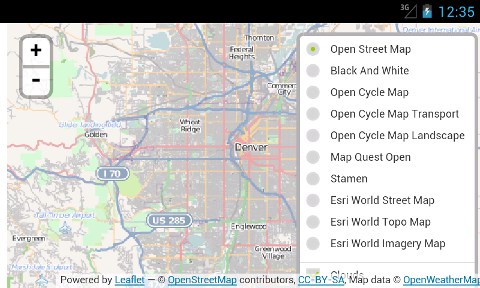
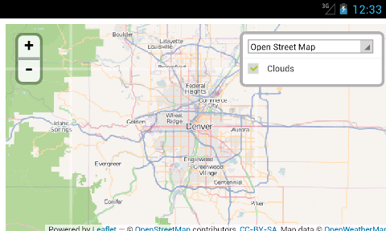
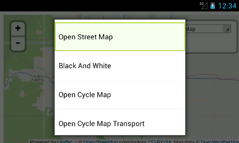
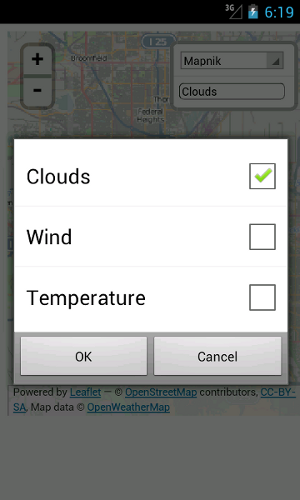

#Important
Please look at the [issue](https://github.com/vogdb/SelectLayersControl/issues/1) before using this plugin.

# Leaflet.SelectLayersControl
A Leaflet plugin which adds new control to switch between different layers on the map. New control extends [L.Control.ActiveLayers](https://github.com/vogdb/Leaflet.ActiveLayers "ActiveLayers") and replaces radio button panel with select tag. This plugin will be useful for you when you have a lot of the base layers in the control. For example.

### It is very hard to tap on a desirable layer and the "Clouds" layer can't be tapped at all on a screenshot below.

### The SelectLayersControl plugin solving this problem.

## Example usage

    var attribution = '&copy; <a href="http://openstreetmap.org">OpenStreetMap</a> contributors, <a href="http://creativecommons.org/licenses/by-sa/2.0/">CC-BY-SA</a>'

    mapnikLayer = L.tileLayer(
        'http://{s}.tile.openstreetmap.org/{z}/{x}/{y}.png',
        {attribution: attribution}
    )
    var blackAndWhite = L.tileLayer(
        'http://{s}.www.toolserver.org/tiles/bw-mapnik/{z}/{x}/{y}.png',
        {attribution: attribution}
    )
    var clouds = L.tileLayer('http://{s}.tile.openweathermap.org/map/clouds/{z}/{x}/{y}.png', {
        attribution: 'Map data &copy; <a href="http://openweathermap.org">OpenWeatherMap</a>',
        opacity: 0.5
    })

    map = L.map('map', {
        center: new L.LatLng(39.73, -104.99),
        zoom: 10,
        layers: [mapnikLayer, clouds]
    })

    var baseLayers = {
        'Mapnik': mapnikLayer,
        'Black and Whilte': blackAndWhite
    }
    var overlayLayers = {
        'Clouds': clouds
    }

    var control = L.control.selectLayers(baseLayers, overlayLayers)
    control.addTo(map)

## API
Plugin inherits API from L.Control.Layers and L.Control.ActiveLayers.